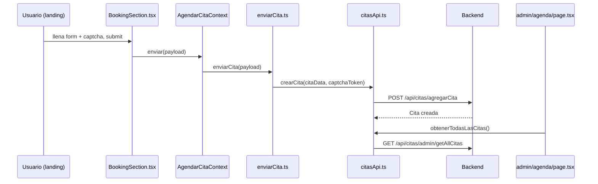

# Documentación de Arquitectura Completa — Kuche Plataforma (Frontend)

> Objetivo: servir de referencia para replicar la lógica, estructura y esencia de este sistema en otra rama/proyecto. Cubre el dashboard admin (kanban), levantamiento detallado, cotización formal, citas/visitas, subida de archivos, confirmación de clientes, catálogo de electrodomésticos/extras, y el portal de seguimiento del cliente.

Base técnica: Next.js (App Router) + TypeScript + React Context (sin Redux). Cliente HTTP centralizado en `src/lib/axios/axiosConfig.ts` (`NEXT_PUBLIC_API_URL`, fallback prod `https://backend-cocinas-inteligentes.vercel.app`, dev `http://localhost:3001`). No hay envío de emails desde el frontend; todo pasa por el backend.

---

## 1. Modelo general y capas de datos

Existen **dos modelos de backend distintos que conviven en el mismo tablero Kanban**: `Cita` (visitas agendadas) y `Tarea` (proyecto en workflow). El frontend los une con un tipo intermedio `AdminWorkflowTask`.

### 1.1 Capas de tipo (de UI a backend)

1. **`KanbanTask`** (base UI) — [src/lib/kanban.ts](src/lib/kanban.ts)
   - `id`, `title`, `stage: TaskStage`, `status: "pendiente"|"completada"`, `assignedTo: string[]`, `project`, `notes`, `location`, `mapsUrl`, `priority: "alta"|"media"|"baja"`, `dueDate`, `createdAt`.
   - `followUpEnteredAt` / `followUpStatus: "pendiente"|"confirmado"|"inactivo"|"descartado"` (solo aplica en etapa `contrato`).
   - `citaStarted` / `citaFinished` (progreso de sub-tarea por etapa).
   - `designApprovedByAdmin` / `designApprovedByClient` (aprobaciones de diseño).
   - `visitScheduledAt` (ISO) — fecha de visita/levantamiento agendada tras aprobar diseño.
   - `preliminarData` / `cotizacionFormalData` (+ arreglos plurales `preliminarCotizaciones` / `cotizacionesFormales`).
   - `inversion`, `contractDate`, `estimatedDeliveryDate`, `etapaActual`, `codigoProyecto` (para el portal de seguimiento).

2. **`AdminWorkflowTask`** (extiende `KanbanTask`) — [src/lib/admin-workflow.ts](src/lib/admin-workflow.ts)
   - `sourceId`, `clientId`, `assignedToIds: string[]`.
   - `backendSource: "tarea" | "cita"` — indica de qué colección viene la tarjeta.
   - `scheduledAt`, `sourceType: "cita"|"diseno"|null`, `sourceCitaId`, `sourceDisenoId`.
   - `visita: { fechaProgramada, aprobadaPorAdmin, aprobadaPorCliente, actualizadaEn }` (espejo legacy de las aprobaciones/fecha, dentro del sub-objeto backend).
   - `cita: { fechaAgendada, nombreCliente, correoCliente, telefonoCliente, ubicacion, informacionAdicional }`.
   - `clientFiles`, `pagos` (`anticipo`/`segundoPago`/`liquidacion`, cada uno con `amount`/`date`/`receiptLabel`/`receiptImage`), `seguimientoNota`.

3. **`Tarea`** (contrato backend) — [src/lib/axios/tareasApi.ts](src/lib/axios/tareasApi.ts)
   - Espejo tal cual lo entrega la API: `etapa`, `estado`, `asignadoA` (id o ids), `asignadoANombre`, `nombreProyecto`, `visita: VisitaTarea`, `cita: CitaTarea`, `archivos: ArchivoTarea[]`, etc.

### 1.2 Regla de precedencia importante (bug ya corregido, mantenerla al replicar)

Al construir el payload de actualización (`buildTaskUpdatePayload`), **los campos planos recién editados del patch tienen prioridad** sobre el objeto `visita` legado:
- Primero se setea `payload.designApprovedByAdmin/Client` desde el patch.
- Luego se refleja en `visitaPatch` (sobrescribe el `visita` combinado).
- En toda la UI se lee con el patrón: `task.designApprovedByAdmin ?? task.visita?.aprobadaPorAdmin ?? false`.

También: `updateTask` **nunca** debe incluir `asignadoA` (asignación de trabajadores va por un endpoint separado, ver 2.3) — está documentado explícitamente en el código como regla de diseño.

---

## 2. Dashboard Admin — Kanban de tareas (`/admin/operaciones`)

### 2.1 Etapas (`TaskStage`)

```
citas → disenos → cotizacion → contrato ("Seguimiento")
```
No existe una etapa "levantamiento" propia: el levantamiento/visita es un **campo** (`visitScheduledAt`) dentro de la etapa `disenos`, no una columna.

### 2.2 Reglas de transición (`moveTask(task, stage)` en `AdminWorkflowContext`)

- **`disenos → *`**: bloqueado si `designApprovedByAdmin` y `designApprovedByClient` no son ambos `true` (con fallback a `visita.aprobadaPorAdmin/aprobadaPorCliente`). Lanza `Error(...)` capturado por la UI de drag&drop.
- **`citas → *`** (cuando `backendSource === "cita"`): no es un simple cambio de columna, se **promueve** la cita a una `Tarea` real vía `promoverCitaATarea` (ver 4.4).
- **Columna `contrato`**: solo muestra tarjetas con `followUpStatus === "pendiente"`; las confirmadas/inactivas se filtran del tablero y viven en vistas separadas (`clientes-confirmados`, `proyectos-inactivos`).
- (Existe un componente legado `KanbanTablero.tsx` con auto-avance basado en `runtimeStore`/localStorage — **no está conectado** a la página real `operaciones/page.tsx`; no replicar ese patrón, es código muerto.)

### 2.3 Funciones de `AdminWorkflowContext`

| Función | Qué hace | Endpoint |
|---|---|---|
| `refresh()` | `cargarTableroAdmin()` → 4 GET en paralelo | `/api/kanban/citas`, `/disenos`, `/cotizacion`, `/contrato` |
| `moveTask(task, stage)` | Valida aprobación de diseño; según `backendSource` actualiza cita, promueve cita→tarea, o cambia etapa | `PATCH /api/tareas/:id/etapa` (fallback `PATCH /api/tareas/:id`) |
| `updateTask(task, patch)` | Arma payload (`buildTaskUpdatePayload` / `buildCitaUpdatePayload`) y actualiza; siempre hace `refresh()` al final | `PATCH /api/tareas/:id` o vía citas |
| `assignWorkers(task, assignedToIds)` | Separado deliberadamente de `updateTask` | `PUT /api/tareas/:id/asignar-trabajadores` (o `PUT /api/citas/:id/asignarIngenieros`) |
| `createTask(data)` | Crea tarea nueva | `POST /api/tareas` |
| `deleteTask(task)` | Elimina tarea o cita | `DELETE /api/tareas/:id` / `DELETE /api/citas/:id` |
| `reactivateTask(task)` | Azúcar sobre `updateTask({followUpStatus:"pendiente", followUpEnteredAt: Date.now(), status:"pendiente"})` | — |
| `markFollowUpAlerts(dias=3)` | Intenta backend, si falla calcula localmente | `GET /api/kanban/seguimiento/alertas?dias=N` |

Todas las mutaciones envuelven `setIsMutating(true/false)`.

### 2.4 Drag & drop (UI real: `src/app/admin/operaciones/page.tsx`)

- Tarjeta: `draggable` + `onDragStart` guarda `draggedTaskId`.
- Columna: `onDragOver` (preventDefault) + `onDrop` → `handleDrop(stage)`.
- `handleDrop` busca la tarea, si cambió de `stage` llama `moveTask(task, stage)`, captura el `Error` de validación de diseño y muestra feedback.

### 2.5 Helpers de estado de seguimiento (`admin-workflow.ts`)

```ts
export const isTaskConfirmed = (task) => task.followUpStatus === "confirmado";
export const isTaskDiscarded = (task) => task.followUpStatus === "inactivo";
export const isTaskInProgress = (task) => !isTaskConfirmed(task) && !isTaskDiscarded(task);
```
El valor legado `"descartado"` del backend se normaliza siempre a `"inactivo"` (`followUpMap`). **Es ortogonal al `stage`**: una tarea puede estar en cualquier columna del kanban y a la vez estar confirmada/en proceso/descartada — son dos ejes independientes.

### 2.6 Endpoints/axios centralizadores

- [src/lib/axios/adminWorkflowApi.ts](src/lib/axios/adminWorkflowApi.ts): orquesta, incluye `promoverCitaATarea`.
- [src/lib/axios/kanbanApi.ts](src/lib/axios/kanbanApi.ts): `GET /api/kanban/{citas|disenos|cotizacion|contrato}` con fallback a `GET /api/tareas?etapa=X`.
- [src/lib/axios/tareasApi.ts](src/lib/axios/tareasApi.ts): CRUD completo de tareas + `PATCH /:id/etapa`, `PATCH /:id/estado`, `PUT /:id/asignar-trabajadores`, `POST /:id/archivos`.
- [src/lib/axios/citasApi.ts](src/lib/axios/citasApi.ts): ver sección 4.

---

## 3. Confirmación de cliente / Proyectos en proceso / Descartados

Eje independiente al `stage`, controlado por `followUpStatus` (ver 2.5).

| Página | Filtro |
|---|---|
| [src/app/admin/clientes-confirmados/page.tsx](src/app/admin/clientes-confirmados/page.tsx) | `isTaskConfirmed` |
| [src/app/admin/clientes-en-proceso/page.tsx](src/app/admin/clientes-en-proceso/page.tsx) | `isTaskInProgress` |
| [src/app/admin/proyectos-inactivos/page.tsx](src/app/admin/proyectos-inactivos/page.tsx) | `isTaskDiscarded` (+ `reactivateTask` para revertir) |
| `src/app/admin/clientes-descartados/page.tsx` | Alias de ruta (`export { default } from "../proyectos-inactivos/page"`) |

- `clientes-confirmados` además administra **recibos de pago** (`recibo_1/2/3`, subidos con `subirArchivoConMetadata`, sin `agregarArchivos` porque se guardan en un "public status" aparte) y cachea un timeline (`etapaActual`) en `localStorage` bajo `kuche-admin-public-status-map-confirmados`, que alimenta el portal de seguimiento del cliente.
- El dashboard general (`/admin`, `src/app/admin/page.tsx`) cuenta `confirmedClients`/`discardedClients` con estos mismos predicados.

---

## 4. Citas y Visitas

### 4.1 Estructura `Cita` — [src/lib/axios/citasApi.ts](src/lib/axios/citasApi.ts)

```ts
interface Cita {
  _id: string;
  fechaAgendada: string; fechaInicio?: string; fechaTermino?: string;
  nombreCliente: string; correoCliente: string; telefonoCliente: string;
  clienteId?: string; clienteRef?: string; cliente?: ClienteCita;
  ubicacion?: string;
  diseno?: { _id, nombre, descripcion?, imagenes? };
  informacionAdicional?: string;
  estado: 'programada' | 'en_proceso' | 'completada' | 'cancelada';
  ingenieroAsignado?: IngenieroObj | string | (IngenieroObj | string)[]; // polimórfico
  especificacionesInicio: { medidas?, estilo?, especificaciones?, materialesPreferidos? };
  createdAt: string; updatedAt: string;
}
```
`ingenieroAsignado` puede ser string, objeto poblado o arreglo mixto — todo consumidor debe normalizar con `Array.isArray`.

### 4.2 Flujo landing → admin



- `/agendar` (público) → `AgendarCitaProvider` + `BookingSection` (calendario, bloqueo de horarios vía `obtenerHorariosOcupados`/`obtenerDisponibilidadDia`) + `LevantamientoSection` (informativa).
- `enviarCita.ts` valida campos requeridos, arma `fechaAgendada` ISO, llama `crearCita`.
- `crearCita()` → `POST /api/citas/agregarCita` (pública, `skipAuthToken`, header `captcha-token`); tolera variantes de respuesta y puede devolver `citasOcupadas` si hay conflicto de horario.
- Admin también puede crear cita directo con `CrearCitaModal.tsx` (usa Turnstile en vez de captcha del landing).

### 4.3 Gestión admin de citas (`/admin/agenda`)

| Acción | Función | Endpoint |
|---|---|---|
| Asignar ingeniero(s) | `asignarIngenierosCita(id, {ingenieroIds})` | `PUT /api/citas/:id/asignarIngenieros` |
| Reagendar/editar datos | `actualizarDatosCita` / `actualizarCita` | `PUT /api/citas/:id/actualizarDatos` / `PUT /api/citas/actualizarCita/:id` |
| Cambiar estado | `actualizarEstadoCita(id, {estado, fechaTermino?})` | `PUT /api/citas/updateEstado/:id` |
| Cancelar | `cancelarCita(id)` (o `actualizarEstadoCita(id,'cancelada')`) | `POST /api/citas/:id/cancel` |
| Eliminar | `eliminarCita(id)` | `DELETE /api/citas/eliminarCita/:id` |
| Ciclo ingeniero | `iniciarCita` → `en_proceso`; `actualizarEspecificaciones`; `finalizarCita` → `completada` + crea `ordenTrabajo` | `PUT /api/citas/:id/{iniciar,especificaciones,finalizar}` |

Componentes: `CitaModal` (detalle/edición/asignación), `CrearCitaModal`, `VisitScheduleModal` (agenda de visita post-aprobación de diseño), `AgendaPage` (calendario mensual + panel + estadísticas).

### 4.4 Conexión Cita ↔ Tarea de workflow

- Las citas viven en el tablero admin como tarjetas `sourceType:"cita"`/`backendSource:"cita"` en la columna `citas`.
- Al mover a otra etapa, `promoverCitaATarea(task, stage)`:
  1. Intenta `POST /api/workflow/citas/:sourceId/promover` con `{etapaDestino}`.
  2. Si 404 (no implementado en backend): **fallback** — `crearTarea({...})` copiando campos de la cita + marca la cita origen `completada` vía `actualizarEstadoCita`.
- `visitScheduledAt` (fecha de visita física, campo plano) es distinto de `fechaAgendada` de la `Cita`. Flujo real: en `/admin/disenos`, al aprobar diseño se abre `VisitScheduleModal`; al confirmar, `handleSaveVisit` llama `persistTask(taskId, {designApprovedByAdmin:true, visitScheduledAt, status:"pendiente", visita:{...}})` — **no se crea tarea nueva**, se actualiza la misma tarea.
- `visitScheduledAt` también se usa como `dueDate`/orden de calendario en `/admin/operaciones` y `/admin` (dashboard).

⚠️ Nota de fragilidad a validar con backend: el endpoint `/api/workflow/citas/:id/promover` puede no estar implementado; el fallback de frontend (crear tarea + cerrar cita) debe mantenerse si se replica en otra rama, hasta confirmar con backend.

---

## 5. Levantamiento Detallado (`/dashboard/Levantamiento-detallado`)

Página independiente de la Cotización Formal (ver sección 6); captura medidas y genera un PDF preliminar.

### 5.1 Estructura `LevantamientoDetalle` — [src/lib/levantamiento-catalog.ts](src/lib/levantamiento-catalog.ts)

```ts
type LevantamientoDetalle = {
  conIsla?: "" | "si" | "no";           // solo relevante si projectType === "Cocinas"
  largo?: string; alto?: string;
  medidasGenerales?: { hastaTecho?: boolean };   // activa factor multiplicador
  sectionComments: Partial<Record<"a"|"b"|"c"|"d"|"e", string>>;

  // Paredes (sección B)
  wallSlotCount: number;                 // 0–4 paredes (modo slots)
  wallMeasures: WallMeasuresMap;
  wallOtro: OtroMedidas;
  wallMedidasModoLibre?: boolean;

  // Electrodomésticos (sección C) — catálogo estático informativo, sin precio
  applianceDocumentIds: string[];
  applianceOtroInDocument: boolean;
  applianceMeasures: Record<string, MedidasCampos>;
  applianceOtro: OtroMedidas;

  // Iluminación (sección D)
  lightingSelectedIds: string[];
  lightingQty: Record<string, number>;
  lightingOtroInDocument: boolean;
  lightingMeasures: Record<string, MedidasCampos>;
  lightingOtro: OtroMedidas;             // única con precioEstimado manual opcional

  // Accesorios especiales (sección E)
  specialAccessoriesQty: Record<string, number>;
  specialAccessoriesMeasures: Record<string, MedidasCampos>;
};
```
`defaultLevantamientoDetalle()` y `normalizeLevantamientoDetalle()` construyen/sanean el objeto de forma defensiva (tolera datos legados/parciales de localStorage o backend).

> Nota de consistencia con memoria previa: los campos `accessoryDocumentIds`/`accessoryOtroInDocument`/`accessoryOtro` **no existen actualmente** en el código (verificado en esta auditoría); los accesorios especiales solo usan `specialAccessoriesQty`/`specialAccessoriesMeasures`. Si al migrar aparece una versión con esos campos, tratarla como legado a normalizar, no como fuente de verdad.

`wallSpecs`/`wallCostEstimate` (tipo `PreliminarWallType`: `pared_lisa|pared_con_ventana|pared_con_puerta|pared_mixta`, en `kanban.ts`) son **residuales**: ningún código actual los calcula/consume; fueron reemplazados por el catálogo de 7 tipos + "Otro" (`WALL_MEASURE_SCHEMA`, `wallSlotCount`/`wallMeasures`).

### 5.2 Cálculo de costos (no es área × precio; es metros lineales × precio/m)

```ts
const factorConfig = clamp(levantamientoConfig.factorHastaTecho ?? 1.25, 1, 5);
const factorActivo = levantamiento.medidasGenerales?.hastaTecho === true ? factorConfig : 1;

costoCubiertas = largo * precioCubiertaM;                    // SIN factor
costoFrentes   = largo * precioFrentesPorM * factorActivo;   // suma de precios de frentes seleccionados
costoHerrajes  = largo * precioHerrajeM * factorActivo;

costoIluminacion          = cotizacionIluminacionTotal(levantamiento, config.iluminacion);
costoAccesoriosEspeciales = cotizacionSpecialAccessoriesTotal(levantamiento, config.accesoriosEspeciales);
costoExtras = costoIluminacion + costoAccesoriosEspeciales;

subtotal = costoCubiertas + costoFrentes + costoHerrajes + costoExtras;
iva = subtotal * ivaPercent;          // default 0.16
total = subtotal + iva;
rangeMin = total * (1 - marginPercent);  // default 0.08
rangeMax = total * (1 + marginPercent);
```
- `factorHastaTecho` solo multiplica **frentes y herrajes**, no cubiertas.
- `resolvePrecioPorMetroForShowroomSelection` resuelve precio: por id exacto → por nombre normalizado → promedio de categoría.
- Existe un "costo de referencia por escenario" legado (`largo * scenarioPrices[escenario]`) que es **solo visual**, no entra al subtotal.
- Campo `costoElectrodomesticos` declarado en `LevantamientoResumenMetrics` pero **nunca asignado** en el cálculo real — posible campo huérfano a revisar si se detecta un bug al migrar.

### 5.3 Tipos de proyecto — [src/lib/catalog-project-types.ts](src/lib/catalog-project-types.ts)

`CATALOG_PROJECT_TYPES = ["Cocinas", "Closets", "Baños", "Muebles a medida"]`. Único efecto directo del tipo sobre el formulario: solo "Cocinas" muestra el campo `conIsla`. El cálculo de costos es igual para todos los tipos.

### 5.4 Validaciones

- Preliminar: requiere al menos un dato de proyecto (cliente/ubicación/semanas) **y** una medida general (`largo` o `alto` > 0).
- Paredes: un slot se considera completo si tiene `type` asignado y al menos un valor no vacío (no exige llenar todos los campos del esquema).
- Los campos requeridos por tipo de pared varían (`WALL_MEASURE_SCHEMA`): p.ej. `pared-recta` solo pide largo + altura al techo; `pared-ventana` pide 7 campos.

### 5.5 Persistencia (⚠️ inconsistencia arquitectónica a resolver o mantener consciente al migrar)

- **Esta página NO usa `AdminWorkflowContext`/axios**. Guarda con `saveKanbanTasksToLocalStorage` → `runtimeStore` (`Map` en memoria, no localStorage real — se pierde al recargar) + escribe `seguimiento-project-{codigo}` directo en `window.localStorage`.
- El avance de etapa `citas → disenos` se hace **mutando el objeto localmente**, no vía backend.
- El PDF preliminar (`buildPreliminarPdfDataUrl`, [src/lib/pdf-preliminar.ts](src/lib/pdf-preliminar.ts)) se guarda solo en IndexedDB (`saveFormalPdf`), no se sube al backend desde aquí (a diferencia de la cotización formal, ver §6.4).

---

## 6. Cotización Formal (`/dashboard/cotizador`)

Cotizador de catálogo (materiales/piezas con cantidad) que sí es fuente de verdad en backend.

### 6.1 Generación de PDFs

- `collectWorkshopPdfBuildInput()` arma `WorkshopPdfBuildInput` (`client`, `projectType`, `location`, `deliveryWeeksLabel`, `precioTotalSinIva`, `montoIva`, `totalNeto`, `lines[]` por ítem con cantidad > 0).
- `buildWorkshopPdfDataUrl(input, logo)` en [src/lib/cotizacion-workshop-pdf.ts](src/lib/cotizacion-workshop-pdf.ts) genera con `jsPDF` + `jspdf-autotable` la "Hoja de Taller".
- El PDF "formal" (`buildFormalPdfDataUrl`) se genera dentro del mismo `cotizador/page.tsx`.
- `buildCotizacionFormalDataFromForm()` arma `CotizacionFormalData` (extiende `PreliminarData`).

### 6.2 Flujo `handleTerminarCotizacion` / `handleTerminarYContinuar`

1. Genera PDF formal + hoja de taller.
2. Descarga local.
3. Sube ambos vía `subirPdfGeneradoConMetadata`.
4. Guarda en IndexedDB (`saveFormalPdf`).
5. Persiste en la tarea con `updateTask(...)` y avanza `stage` a `"contrato"`.

### 6.3 Persistencia en backend (sí usa `AdminWorkflowContext`)

- `updateTask(activeCitaTask, {stage:"disenos", ...})` al terminar la cita.
- `updateTask(activeCotizacionFormalTask, {stage:"contrato", status:"pendiente", ...})` al terminar la cotización formal.
- `buildTaskUpdatePayload` incluye: `titulo`, `etapa`, `estado`, `preliminarData`, `cotizacionFormalData`, `preliminarCotizaciones`, `cotizacionesFormales`, `codigoProyecto`, `visita{fechaProgramada, aprobadaPorAdmin, aprobadaPorCliente}`.
- Backend: `PATCH /api/tareas/:id` (vía `actualizarTarea`) o `actualizarTarjetaCita` si `backendSource==="cita"`.

### 6.4 Integración con catálogo de electrodomésticos/extras (con precio real)

`cotizador/page.tsx` usa `useCatalogEquipamiento()` para leer `electrodomesticos`/`extras` y los mapea a ítems de cotización:
```ts
const electroItems = electrodomesticos.map(item => ({
  id:`equip-electro-${item._id}`, label:item.nombre,
  unitPrice: Math.max(0, Number(item.precio)||0), unitType:"pieza",
}));
// análogo para extras
```
Se combinan con el catálogo base de materiales en `displayCatalog` como dos categorías virtuales: `"ELECTRODOMESTICOS"` y `"EXTRAS EQUIPAMIENTO"`.

---

## 7. Subida de archivos / imágenes

### 7.1 Capa de red — [src/lib/axios/uploadsApi.ts](src/lib/axios/uploadsApi.ts)

- Endpoint: `NEXT_PUBLIC_FILE_UPLOAD_ENDPOINT` o default `{API}/api/archivos/upload`.
- `subirArchivoConMetadata(file, metadata)`: `FormData` con `file` + `{tipo, nivel, relacionadoA, relacionadoId, clienteId, tareasId}` → `POST` multipart. Tolera distintas formas de respuesta (`url`, `data.url`, `data.archivoUrl`, `data.fileUrl`).
- `subirPdfGeneradoConMetadata(dataUrl, filename, metadata)`: convierte dataURL→File y delega en la anterior.
- `subirArchivoYObtenerUrl(file)`: azúcar que regresa solo `.url`.
- `subirMultiplesArchivosConMetadata(files[], metadata)`: paralelo con `Promise.all`.
- `UploadTipo`: `levantamiento_detallado | diseno | diseno_final | cotizacion_formal | hoja_taller | recibo_1/2/3 | contrato | fotos_proyecto | ...`.
- Uploader aparte para imágenes de catálogo de equipamiento: `equipamientoApi.ts` → Cloudinary (`subirImagenCloudinary`, rutas candidatas en cascada).

### 7.2 Flujo de 2 pasos (subir → vincular a la tarea)

1. **Paso 1**: `subirArchivoConMetadata(file, {...})` sube el binario y persiste en `ClienteArchivo` (colección aparte, asociada a `clienteId`/`tareasId`).
2. **Paso 2 (legado/kanban, no bloqueante)**: `agregarArchivos(id, archivos[])` → `POST /api/tareas/:id/archivos` con `{archivos}` (sanitizando URLs vacías para evitar 400). `ClienteArchivo` es la fuente principal; este paso es un fallback de sincronización.

Ejemplos: subida de diseño (admin), subida de diseño final (avanza a `stage:"cotizacion"` tras marcar `designApprovedByClient:true`), recibos de pago (solo paso 1, se guardan en "public status" aparte), PDFs de levantamiento/cotización formal (paso 1 con `tipo:"levantamiento_detallado"|"cotizacion_formal"`).

### 7.3 Lectura de archivos del cliente

`useClienteArchivos.ts` (con caché en memoria a nivel de módulo) llama `obtenerArchivosCliente(clienteId)` ([archivosClienteApi.ts](src/lib/axios/archivosClienteApi.ts)) y mapea `ClienteArchivo` → `TaskFile` (`{id, name, type:"pdf"|"render"|"otro", src}`).

---

## 8. Electrodomésticos y Extras (catálogo de equipamiento)

### 8.1 Dos modelos de catálogo distintos

**A) Materiales/Herrajes** (construcción, sin imagen/Cloudinary) — [catalogosApi.ts](src/lib/axios/catalogosApi.ts):
```ts
interface Material { _id, nombre, precioUnitario?, precioPorMetro?, precioMetroLineal?, idCotizador?, descripcion?, unidadMedida?, seccion?, proveedor?, disponible? }
interface Herraje extends Material { categoria?: CategoriaCatalogo }
```
CRUD: `obtenerMateriales/crearMaterial/actualizarMaterial/eliminarMaterial` (y equivalentes `Herraje`) con fallback en cascada de rutas (`/api/catalogos/materiales`, `/api/materiales`, `/api/catalogo/materiales`). Gestionado en `/admin/precios` (sin context, llamadas directas a `catalogosApi`).

**B) Electrodomésticos y Extras** (con precio de venta e imagen Cloudinary) — [equipamientoApi.ts](src/lib/axios/equipamientoApi.ts):
```ts
interface EquipamientoBase { _id, nombre, precio?, descripcion?, imagenUrl?, thumbnailUrl?, disponible?, categoria?, subtipo? }
interface Electrodomestico extends EquipamientoBase { categoria: string }         // requerida
interface Extra extends EquipamientoBase { categoriaId?: string; categoria: string }
interface ElectroCategoria { _id, nombre, descripcion?, orden?, disponible? }
interface ExtraCategoria    { _id, nombre, descripcion?, orden?, disponible? }
```
Gestionado en `/admin/equipamiento` (3 tabs: `electro`, `categorias`, `extras`) vía `CatalogEquipamientoContext` (no llamadas directas). Permisos: `canMutate` = admin o empleado; `canDelete` = solo admin.

### 8.2 Endpoints (fallback en cascada, prueba cada ruta hasta 2xx o error≠404)

- Electrodomésticos: `/api/electrodomesticos`, `/api/catalogos/electrodomesticos`.
- Categorías electro: `/api/electrodomesticos/categorias`, `/api/electro-categorias`, `/api/catalogos/electro-categorias`.
- Extras: `/api/extras`, `/api/catalogos/extras`.
- Categorías extras: `/api/extras/categorias`, `/api/extras-categorias`, `/api/catalogos/extras-categorias`.
- Upload imagen: `/api/uploads/cloudinary`, `/api/cloudinary/upload`, `/api/media/cloudinary`.

Nota: `equipamientoApi.ts` devuelve `{success:false}` en vez de lanzar cuando falla (a diferencia de `catalogosApi.ts`, que re-lanza si el status no es 404).

### 8.3 `CatalogEquipamientoContext`

Carga en paralelo `obtenerElectrodomesticos({disponible:true})`, `obtenerCategoriasElectrodomesticos()`, `obtenerCategoriasExtras()`, `obtenerExtras({disponible:true})`. Se monta en `src/app/admin/layout.tsx` y `src/app/dashboard/layout.tsx`, envolviendo todo el árbol admin/dashboard. Expone estado + CRUD.

Consumido por:
- **Cotizador formal** (§6.4): con precio real, impacta el subtotal.
- **Levantamiento Detallado**: **NO** usa este context — usa un catálogo estático informativo (`APPLIANCE_ITEMS` en `levantamiento-catalog.ts`, sin `_id`/precio), solo para marcar tipos de electrodoméstico en el PDF; el costo se calcula por metro lineal + `extrasPrecios` fijo (§5.2), no por precio unitario del catálogo.

### 8.4 "Extra" — 3 significados distintos a no confundir

1. **`Extra` (modelo DB)**: equipamiento adicional con catálogo propio (`/admin/equipamiento`, tab Extras).
2. **`extrasPrecios`** (config del Levantamiento): precios fijos por `id` para `iluminacion`/`accesoriosEspeciales` en `config-levantamiento.ts`, independiente del modelo `Extra`.
3. **Equipamiento estándar (`Electrodomestico`)**: mismo shape base que `Extra`, diferenciado solo por `categoriaId` opcional y colección/endpoints propios.

---

## 9. Portal de Seguimiento del Cliente (`/seguimiento`)

### 9.1 Autenticación — [src/contexts/SeguimientoAuthContext.tsx](src/contexts/SeguimientoAuthContext.tsx)

- Bloqueo tras `MAX_FAILED_ATTEMPTS = 5` intentos por `LOGIN_LOCK_MS = 5 min`.
- `login(code)`: normaliza el código, llama `autenticarSeguimientoCliente(codigo)` → `POST /api/seguimiento/login` (prueba 3 shapes de payload en cascada: `{codigo}`, `{code}`, `{clienteId}`, reintenta solo en 401). Público (`skipAuthToken`, `withCredentials:false`).
- Respuesta `{token, expiresAt, project}` → se normaliza y guarda como `SeguimientoProject`.

### 9.2 Datos consumidos — [src/app/seguimiento/lib.ts](src/app/seguimiento/lib.ts)

- `SeguimientoProject` incluye `preliminarData`, `cotizacionFormalData`, `preliminarCotizaciones[]`, `cotizacionesFormales[]`.
- `filterArchivosForCliente` excluye archivos internos (hoja de taller: `indexedPdfKey` que empiece con `"workshop-"` o nombre que contenga "hoja de taller").
- `ConfirmedDashboard`: cotizaciones formales descargables, estado de pagos (`installments`: anticipo/segundoPago/liquidacion), timeline (`TIMELINE_STEPS`), contador de garantía (365 días).
- `ProspectDashboard`: vista reducida para clientes no confirmados (`isProspect`).

---

## 10. Resumen de inconsistencias/deuda técnica conocida (mantener presente al migrar)

1. **Levantamiento Detallado no persiste en backend** (usa `runtimeStore` en memoria + `localStorage` directo), mientras que **Cotización Formal sí** (vía `AdminWorkflowContext.updateTask` → `PATCH /api/tareas/:id`). Si se unifica en la rama nueva, decidir conscientemente cuál gana.
2. `wallSpecs`/`wallCostEstimate` y `costoElectrodomesticos` son campos declarados pero no usados/asignados — no replicar como si fueran lógica activa.
3. El endpoint `/api/workflow/citas/:id/promover` puede no estar implementado en backend; el frontend depende de un fallback (crear tarea + cerrar cita) — confirmar con backend antes de asumir que existe.
4. `KanbanTablero.tsx` es código legado (usa `runtimeStore`, auto-avance de etapas) no conectado a la página real (`operaciones/page.tsx`) — no usar como referencia de la lógica viva.
5. Mantener la regla de precedencia de campos planos sobre `visita.*` legado (sección 1.2) y la separación de `assignWorkers` vs `updateTask` (nunca mezclar `asignadoA` en el payload general).

---

## 11. Mapa de replicación rápida para otra rama

### 11.1 Orden recomendado de migración

1. **Infraestructura base**: dejar listo el cliente HTTP centralizado, variables de entorno y rutas de API.
2. **Modelo compartido**: replicar `KanbanTask`, `AdminWorkflowTask`, `LevantamientoDetalle` y los tipos de seguimiento antes de tocar UI.
3. **Admin workflow**: implementar primero el tablero, la creación/actualización de tareas y las reglas de transición de etapa.
4. **Agendado y levantamiento**: conectar citas, visitas y preliminares después del core del tablero.
5. **Cotización formal y archivos**: integrar los PDFs, upload y vinculación a tarea una vez que el workflow base funcione.
6. **Seguimiento cliente**: dejar el portal como capa de lectura/visualización sobre los mismos datos de proyecto.

### 11.2 Archivos críticos por dominio

- **Base y configuración**
  - [src/lib/axios/axiosConfig.ts](src/lib/axios/axiosConfig.ts)
  - [src/lib/config-levantamiento.ts](src/lib/config-levantamiento.ts)
  - [package.json](package.json)
  - [vercel.json](vercel.json)

- **Admin / Kanban**
  - [src/app/admin/operaciones/page.tsx](src/app/admin/operaciones/page.tsx)
  - [src/components/admin/KanbanTablero.tsx](src/components/admin/KanbanTablero.tsx)
  - [src/lib/admin-workflow.ts](src/lib/admin-workflow.ts)
  - [src/lib/kanban.ts](src/lib/kanban.ts)

- **Citas / visitas**
  - [src/lib/axios/citasApi.ts](src/lib/axios/citasApi.ts)
  - [src/app/admin/agenda/page.tsx](src/app/admin/agenda/page.tsx)
  - [src/components/agendar/BookingSection.tsx](src/components/agendar/BookingSection.tsx)

- **Levantamiento y cotización**
  - [src/app/dashboard/Levantamiento-detallado/page.tsx](src/app/dashboard/Levantamiento-detallado/page.tsx)
  - [src/lib/levantamiento-catalog.ts](src/lib/levantamiento-catalog.ts)
  - [src/lib/pdf-preliminar.ts](src/lib/pdf-preliminar.ts)
  - [src/app/dashboard/cotizador/page.tsx](src/app/dashboard/cotizador/page.tsx)
  - [src/lib/cotizacion-workshop-pdf.ts](src/lib/cotizacion-workshop-pdf.ts)

- **Archivos y seguimiento**
  - [src/lib/axios/uploadsApi.ts](src/lib/axios/uploadsApi.ts)
  - [src/hooks/useClienteArchivos.ts](src/hooks/useClienteArchivos.ts)
  - [src/contexts/SeguimientoAuthContext.tsx](src/contexts/SeguimientoAuthContext.tsx)
  - [src/app/seguimiento/lib.ts](src/app/seguimiento/lib.ts)

### 11.3 Checklist de replicación segura

- Mantener el backend como fuente de verdad; evitar reintroducir lógica de persistencia basada solo en `localStorage` para el flujo principal.
- Separar claramente los ejes de workflow (`stage`) y seguimiento (`followUpStatus`).
- Preservar la regla de precedencia de campos planos sobre `visita.*` cuando se actualicen tareas.
- Mantener `assignWorkers` separado de `updateTask` para no mezclar responsabilidades.
- Documentar cualquier endpoint de promoción de citas a tarea como potencialmente dependiente del backend, porque puede requerir fallback.
- Reusar el mismo modelo de archivos y PDFs para levantamiento, cotización y recibos, en vez de duplicar flujos por pantalla.

### 11.4 Recomendación final de implementación

La estrategia más estable para replicar esta plataforma en otra rama es construirla por capas:

1. tipos y helpers de dominio,
2. cliente HTTP y autenticación,
3. workflow de admin/kanban,
4. agendado y levantamiento,
5. cotización formal, archivos y seguimiento del cliente.

Este orden minimiza el riesgo de reintroducir deuda técnica y permite validar cada dominio por separado antes de pasar al siguiente.
