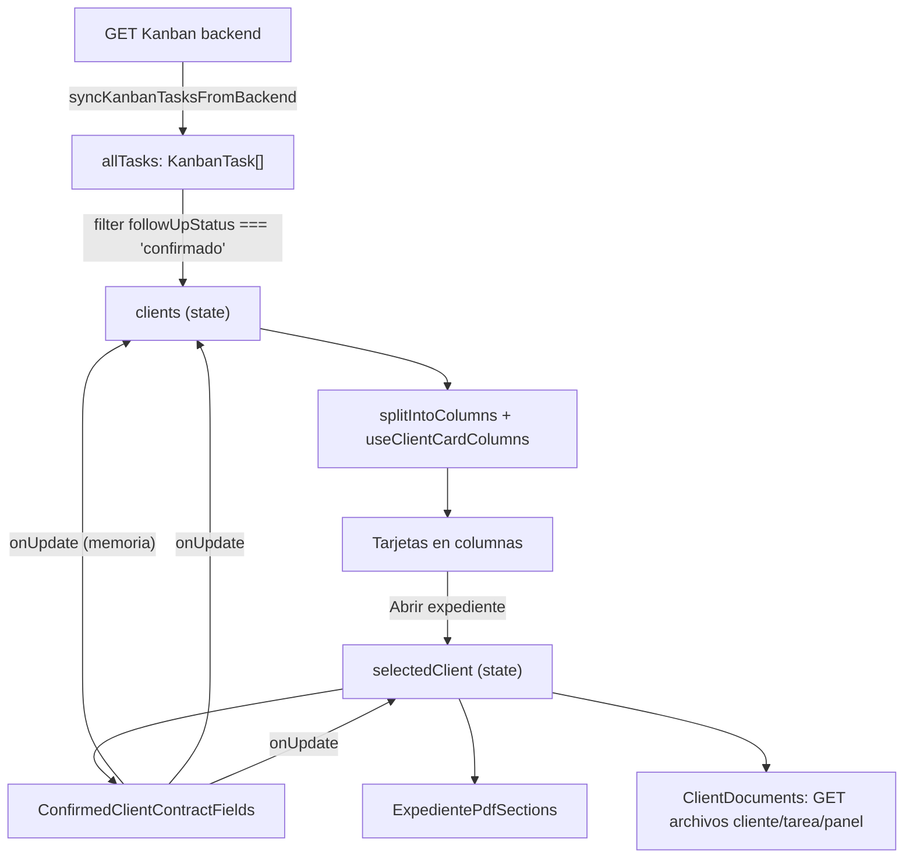

# Página: Clientes Confirmados (`/admin/clientes-confirmados`)

Documentación funcional de la página para poder **replicarla en otro repo** (misma lógica, mismo diseño).

Archivo principal: [src/app/admin/clientes-confirmados/page.tsx](../src/app/admin/clientes-confirmados/page.tsx)

---

## 1. Qué muestra la página

Lista (en tarjetas) de todos los `KanbanTask` del tablero Kanban que tienen `followUpStatus === "confirmado"`, es decir, clientes cuyo proyecto ya fue confirmado por el admin desde la columna "Seguimiento" del Kanban.

Cada tarjeta resume el cliente y permite abrir un panel lateral ("Expediente") con más detalle y acciones (editar fechas, ver/descargar PDFs).

---

## 2. Origen de los datos

- **Fuente de las tarjetas:** backend Kanban mediante `syncKanbanTasksFromBackend()` → `fetchBackendKanbanTasks()` (`src/lib/admin-workflow.ts`). La respuesta se mantiene en `runtimeKanbanTasks` en memoria (`src/lib/kanban.ts`) para que las vistas compartan el mismo estado. Aunque algunas funciones conservan el nombre histórico `getTasksFromLocalStorage`, actualmente no leen `localStorage`.
- **Archivos del expediente:** se consultan por API al abrir un expediente; no forman parte de `KanbanTask` ni de `runtimeKanbanTasks`.
- Al montar (`useEffect`):
  1. Llama `syncKanbanTasksFromBackend()`.
  2. Si devuelve tareas, filtra `followUpStatus === "confirmado"` → `clients`.
  3. Marca `isHydrated = true` para terminar el estado de carga.
- Si falla la sincronización, la página muestra el estado vacío; no hay persistencia local duradera de respaldo en esta implementación.
- Las ediciones de fecha propagan cambios al estado en memoria con `onUpdate`; no asumir persistencia tras recargar hasta que exista una mutación backend conectada.

### Modelo `KanbanTask` (campos relevantes a esta página)

Definido en [src/lib/kanban.ts](../src/lib/kanban.ts):

| Campo | Tipo | Uso en esta página |
|---|---|---|
| `id` | `string` | Key de React / match al actualizar |
| `project` | `string` | Nombre del proyecto/cliente (título de la tarjeta) |
| `title` | `string` | Puede repetir `project`; si difiere se muestra como subtítulo (`getTaskCardSubtitle`) |
| `followUpStatus` | `"pendiente" \| "confirmado" \| "descartado"` | Filtro: solo `"confirmado"` entra a esta vista |
| `codigoProyecto` | `string?` | Código que el cliente usa en `/seguimiento` (ej. `K-8821`); se muestra en tarjeta y expediente |
| `contractDate` | `string? (ISO YYYY-MM-DD)` | Fecha de contrato, editable en el expediente |
| `estimatedDeliveryDate` | `string? (ISO YYYY-MM-DD)` | Fecha de entrega manual (opcional), editable en el expediente; si existe, **tiene prioridad** sobre el cálculo automático |
| `preliminarData` / `preliminarCotizaciones` | `PreliminarData \| PreliminarData[]` | Cotizaciones preliminares (levantamiento); legado singular vs. array nuevo |
| `cotizacionFormalData` / `cotizacionesFormales` | `CotizacionFormalData \| CotizacionFormalData[]` | Cotizaciones formales + hoja de taller; legado singular vs. array nuevo |

`PreliminarData` incluye: `projectType`, `location`, `date` (texto de semanas, ej. `"8 a 12 semanas aprox."`), medidas, desglose de costos y `levantamiento` (detalle opcional). `CotizacionFormalData` extiende lo anterior con `formalPdfKey` / `workshopPdfKey` (claves hacia IndexedDB) y un `pdfDataUrl` deprecado.

### Funciones helper usadas (todas en `src/lib/kanban.ts` salvo que se indique)

- `deriveProjectTypesLabel(task)` → string con los tipos de espacio únicos (ej. `"Cocinas, Closets"`), tomados de las cotizaciones formales y preliminares.
- `getTaskCardSubtitle(task)` → `title` si es distinto de `project` (evita redundancia visual).
- `getConfirmedCardProjectLines(task)` → lista `{ projectType, weeksLabel }`, priorizando cotizaciones **formales**; si no hay, usa **preliminares**.
- `getAggregatedDeliveryWeeksFromTask(task)` → `{ min, max }` semanas combinando todas las cotizaciones (parseadas desde el texto `date` con `parseDeliveryWeeksRangeFromLabel` de [src/lib/delivery-weeks.ts](../src/lib/delivery-weeks.ts)).
- `getPreliminarList(task)` / `getCotizacionesFormalesList(task)` → normalizan legado (campo singular) vs. array nuevo, siempre devuelven array.
- `getCardDeliverySummary(task)` (definida en la propia página): prioridad `estimatedDeliveryDate` manual → si no, calcula rango de fechas sumando semanas (`getAggregatedDeliveryWeeksFromTask`) a `contractDate`.
- `formatIsoDateLong(iso)` (en la página) y `formatApproximateDeliveryWindowEs` (en `delivery-weeks.ts`) → formateo de fechas en español (`es-MX`).

---

## 3. Diseño / layout

- Contenedor general: fondo degradado `from-accent/30 to-white`, max-width `6xl` centrado, padding responsivo.
- **Header**: enlace "Volver al panel" (`/admin`) + icono `CheckCircle2` en círculo verde esmeralda + título "Clientes Confirmados" + subtítulo descriptivo. Animado con `framer-motion` (`fade + slide up`).
- **Grid de tarjetas en columnas**: no usa CSS grid, sino un reparto manual en columnas:
  - `useClientCardColumns(3)` ([src/hooks/useClientCardColumns.ts](../src/hooks/useClientCardColumns.ts)) decide cuántas columnas (hasta 3) según ancho de viewport.
  - `splitIntoColumns(clients, columnCount)` ([src/lib/split-into-columns.ts](../src/lib/split-into-columns.ts)) reparte el array de clientes en N sub-arrays (uno por columna), manteniendo el orden tipo "round robin" o similar para que las columnas no desbalanceen mucho.
  - Se renderiza `flex flex-col md:flex-row` con una columna (`flex flex-col gap-4`) por cada subarray.
- **Tarjeta de cliente** (`rounded-2xl border bg-white p-5 shadow-sm`, hover con borde/sombra esmeralda):
  - Icono `User` en círculo esmeralda + "Proyecto" (label) + `project` (nombre) + subtítulo opcional + código de proyecto opcional.
  - Badge "Confirmado" (esmeralda) alineado a la derecha.
  - Bloque de 3 filas con icono + label + valor: **Tipo(s) de proyecto** (`LayoutTemplate`), **Fecha de contrato** (`FileSignature`, ámbar "Pendiente" si falta), **Fecha de entrega** (`CalendarClock`, "Por definir" si no hay dato).
  - Botón "Abrir expediente" (ancho completo, fondo esmeralda) → `setSelectedClient(client)`.
- **Banner inferior**: fondo esmeralda claro con el conteo total: `Total de clientes confirmados: {n}`.
- **Estado vacío**: si `clients.length === 0`, tarjeta centrada con icono `User` gris y mensaje "No hay clientes confirmados aún".
- **Loading**: antes de hidratar (`!isHydrated`), spinner centrado en pantalla completa.
- **Panel "Expediente" (drawer lateral)**:
  - `AnimatePresence` + overlay oscuro (`bg-black/50`, clic cierra) + panel (`aside`) que desliza desde la derecha (`x: "100%" → 0`), ancho máx `max-w-lg`, ocupa toda la altura.
  - Header del panel: título "Expediente", nombre del proyecto, subtítulo, código de proyecto, botón cerrar (`X`).
  - Body con scroll (`overflow-y-auto`): contrato/fechas, PDFs generados y documentos remotos del cliente.
  - Acciones superiores: abrir pagos del proyecto, y subir contrato firmado a Cloudinary.
  - Mientras el panel está abierto, se bloquea el scroll del `body` (`document.body.style.overflow = "hidden"`).

---

## 4. El "Expediente" (panel lateral) en detalle

### 4.1 `ConfirmedClientContractFields` — [src/components/admin/ConfirmedClientContractFields.tsx](../src/components/admin/ConfirmedClientContractFields.tsx)

Props: `{ task: KanbanTask; onUpdate: (next: KanbanTask) => void }`.

Secciones:

1. **Fecha de contrato** (`<input type="date">`):
   - Si no hay fecha guardada, el editor se muestra abierto por defecto.
   - Si ya hay fecha, se muestra en modo lectura (`formatIsoDateEs`) + botón lápiz para re-editar.
   - Al guardar: `window.confirm(...)` → `persistTaskPatch({ contractDate })` → cierra editor y muestra flash "Guardado" 2s.
2. **Fecha estimada de entrega** (mismo patrón que contrato). Nota explicativa: es opcional; si no se define, la tarjeta usa el cálculo automático (cotizador + fecha de contrato).
3. **Tipos de proyecto**: lista (`getConfirmedCardProjectLines`) con `projectType` + `weeksLabel` (texto de semanas tal cual viene de la cotización formal o preliminar).
4. **Entrega estimada (referencia cotizador)**:
   - Muestra el rango agregado de semanas (`getAggregatedDeliveryWeeksFromTask`).
   - Si hay `contractDate` (el que está en el input, no necesariamente guardado) + semanas, calcula y muestra el texto con `formatApproximateDeliveryWindowEs` (ej. "Del 3 de marzo de 2026 al 31 de marzo de 2026 (4 a 8 semanas después del contrato).").
   - Si ya existe `estimatedDeliveryDate` guardada, aclara que esa fecha manual tiene prioridad sobre la tarjeta.

**Propagación (`persistTaskPatch`)**: aplica el `patch` a la tarea actual y llama a `onUpdate(updatedTask)` para refrescar `clients` y `selectedClient`. Esta versión no escribe `localStorage` ni confirma una escritura backend; las fechas podrían perderse tras recargar y deben conectarse a `PATCH /api/tareas/:id` si se requiere persistencia.

### 4.2 `ExpedientePdfSections` — [src/components/admin/ExpedientePdfSections.tsx](../src/components/admin/ExpedientePdfSections.tsx)

Props: `{ client: KanbanTask; withTopDivider?: boolean }`. Es un componente **compartido** (también se usa en la página de "Proyectos inactivos"). Muestra PDFs generados localmente con los datos del `KanbanTask`; no sustituye la lista de archivos subidos al backend.

Dos bloques condicionales (solo se renderizan si hay datos):

1. **Levantamiento detallado** (fondo esmeralda) — uno por cada item de `getPreliminarList(client)`:
   - Muestra `projectType`.
   - Botón "Ver PDF" → `openPreliminarPdfInNewTab(data)`.
   - Botón "Descargar PDF" → `downloadPreliminarPdf(data, filename)`.
   - El PDF **se genera en el momento** (jsPDF) a partir de los datos guardados en la tarea (no hay archivo binario persistido para este caso); ver [src/lib/pdf-preliminar.ts](../src/lib/pdf-preliminar.ts).

2. **Cotización formal + hoja de taller** (fondo violeta) — uno por cada item de `getCotizacionesFormalesList(client)`:
   - Sub-bloque "Formal": "Ver" (`openFormalPdfInNewTab`) y "Descargar" (`downloadFormalPdf`).
   - Sub-bloque "Taller" (solo si `hasWorkshopPdfActions(data)` es `true`, es decir hay `formalPdfKey`/`workshopPdfKey` resolvibles): "Ver" (`openWorkshopPdfInNewTab`) y "Descargar" (`downloadWorkshopPdf`).
   - A diferencia del levantamiento, estos PDFs **sí se generaron previamente** (al terminar la cotización formal en `/dashboard/cotizador`) y se guardaron como *data URL* en **IndexedDB** (no en localStorage, para no saturar su cuota de ~5MB). La tarea solo guarda la **clave** (`formalPdfKey` / `workshopPdfKey`); al pulsar "Ver"/"Descargar" se recupera el blob desde IndexedDB (`getFormalPdf(key)` en [src/lib/formal-pdf-storage.ts](../src/lib/formal-pdf-storage.ts)) y se abre en pestaña nueva (object URL) o se descarga.
   - Fallback: si no hay `formalPdfKey` pero sí `pdfDataUrl` (campo deprecado), se usa ese data URL directo; si tampoco hay nada, `openFormalPdfInNewTab` cae a regenerar el PDF preliminar como aproximación.

3. Si no hay nada de lo anterior: texto "Sin cotizaciones PDF en esta tarjeta."

### Resumen del almacenamiento de PDFs

| Tipo de PDF | Dónde vive el contenido | Qué guarda la tarea (`KanbanTask`) |
|---|---|---|
| Levantamiento (preliminar) | No se persiste binario; se **regenera** on-demand con jsPDF a partir de `PreliminarData` | Los datos (`preliminarData` / `preliminarCotizaciones`) |
| Cotización formal | IndexedDB (`kuche-formal-pdfs`, store `pdfs`), como data URL | `formalPdfKey` |
| Hoja de taller | IndexedDB (misma DB/estructura), como data URL | `workshopPdfKey` |

IndexedDB se usa para evitar el límite de ~5MB de `localStorage`, ya que un PDF en base64 puede pesar varios MB.

### 4.3 Documentos subidos — [src/components/admin/ClientDocuments.tsx](../src/components/admin/ClientDocuments.tsx)

Esta sección lista archivos binarios subidos al cliente/tarea, incluyendo diseños de Dropbox, contrato y otros documentos de Cloudinary. No son los PDFs generados por `ExpedientePdfSections`.

Al abrir el expediente consulta en paralelo:

- `GET /api/archivos/cliente/:codigoProyecto` (compatibilidad plural: `/api/archivos/clientes/:clienteId`).
- `GET /api/archivos/tarea/:tareaId`.
- `GET /api/archivos/panel/:codigoProyecto`.

Combina resultados y elimina duplicados por URL. El normalizador acepta arrays directos y envelopes (`data`, `archivos`, `files`, `result`), y normaliza nombres/enlaces comunes (`nombre`/`name`, `url`/`sharedUrl`/`link`). Cada respuesta debe entregar al menos un enlace legible en `url` (o un alias soportado) y su metadata de cliente/tarea. Los enlaces Dropbox se muestran con su URL compartida y se convierten a `dl=1` para descarga directa.

El botón **Subir contrato** refresca esta lista después de una carga confirmada (`documentsRefreshKey`). Al agregar otros formularios de subida dentro del expediente, llamar el mismo callback de refresco tras recibir éxito real del backend. Si el archivo se sube desde otra página, cerrar y volver a abrir el expediente vuelve a consultar los tres endpoints.

Si el archivo no aparece, verificar Network → Response de `GET /api/archivos/tarea/:tareaId` y comprobar que el backend lo relacionó con el ID real de `KanbanTask.id`; si solo se relacionó por código de cliente, verificar también los endpoints de cliente/panel.

---

## 5. Flujo de actualización de estado (resumen)

---

## 6. Para replicar en otro repo

Piezas mínimas a portar (en este orden de dependencia):

1. `src/lib/kanban.ts` (tipos `KanbanTask`, `PreliminarData`, `CotizacionFormalData` + helpers de lectura/derivación).
2. `src/lib/delivery-weeks.ts` (parseo/format de semanas y ventana de entrega).
3. `src/lib/formal-pdf-storage.ts` (IndexedDB para PDFs formal/taller).
4. `src/lib/pdf-preliminar.ts` (generación/visualización/descarga de PDFs con jsPDF).
5. `src/hooks/useClientCardColumns.ts` + `src/lib/split-into-columns.ts` (layout en columnas).
6. `src/components/admin/ConfirmedClientContractFields.tsx` y `src/components/admin/ExpedientePdfSections.tsx`.
7. La página en sí: [src/app/admin/clientes-confirmados/page.tsx](../src/app/admin/clientes-confirmados/page.tsx).

Dependencias externas usadas: `framer-motion` (animaciones), `lucide-react` (iconos), `jspdf` + `jspdf-autotable` (PDFs, vía `pdf-preliminar.ts`), Tailwind CSS (clases de estilo).

Si el otro repo no comparte el mismo tablero Kanban/localStorage, habrá que adaptar el **origen de datos** (sección 2) a la fuente real de ese proyecto (API, otra key de storage, etc.), pero el resto de la lógica de derivación, diseño y manejo de PDFs puede copiarse casi literal.
